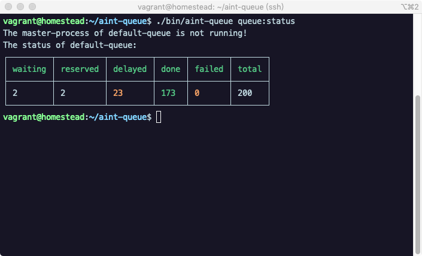

<h1 align="center"> aint-queue </h1>

<p align="center"> A async-queue library built on top swoole, flexable multi-consumer, coroutine supported.</p>

<div align="center"></div>

## Required

- PHP 7.1+
- Swoole 4.3+

## Install

```shell
$ composer require littlesqx/aint-queue -vvv
```

## Document

- [中文](./docs/zh-CN/overview.md)
- English

## Usage

### Config

By default, aint-queue will require `config/aint-queue.php` as default config. If not exist, `/vendor/littlesqx/aint-queue/src/Config/config.php` will be the final config file.

```php
<?php

use Littlesqx\AintQueue\Driver\Redis\Queue as RedisQueue;

return [
    // channel => [...config]
    'default' => [
        'driver' => [
            'class' => RedisQueue::class,
            'connection' => [
                // Dynamic, put everything you want here...
                'host' => '127.0.0.1',
                'port' => 6379,
                'database' => '0',
                // 'password' => 'password',
            ],
        ],
        'pid_path' => '/var/run/aint-queue',
        'worker' => [
            'consumer' => [
                'sleep_seconds' => 2,
                'memory_limit' => 96, // Mb
                'dynamic_mode' => true,
                'capacity' => 6, // The capacity that every consumer can handle in health and in short time,
                                 // it affects the worker number when dynamic-mode.
                'min_worker_number' => 5,
                'max_worker_number' => 30,
            ],
            'monitor' => [
                'job_snapshot' => [
                    'interval' => 5 * 60,
                    'handler' => [],
                ],
                'consumer' => [
                    'flex_interval' => 5 * 60, // only work when consumer.dynamic_mode = true
                ],
                'job' => [
                    'move_expired_interval' => 2,
                ],
            ],
        ],
    ],
];

```

### Queue

```php
<?php

use Littlesqx\AintQueue\Driver\DriverFactory;

// $config = [...];
// or $config = require .../config.php;
$queue = DriverFactory::make('default', $config['default']['driver']);

// push a sync job
$queue->push(function () {
    echo "Hello aint-queue\n";
});

// push a sync and delay job
$closureJob = function () {
    echo "Hello aint-queue delayed\n";
};
$queue->push($closureJob, 5);

// And class job are allowed.
// 1. Create a class which implements JobInterface, you can see the example in `/example`.
// 2. Noted that job pushed should be un-serialize by queue-listener, this means queue-pusher and queue-listener are required to in the same project.                                          
// 3. You can see more examples in `example` directory.
```

### Manage listener

```bash
vendor/bin/aint-queue
```

```bash
Console Tool

Usage:
  command [options] [arguments]

Options:
  -h, --help            Display this help message
  -q, --quiet           Do not output any message
  -V, --version         Display this application version
      --ansi            Force ANSI output
      --no-ansi         Disable ANSI output
  -n, --no-interaction  Do not ask any interactive question
  -v|vv|vvv, --verbose  Increase the verbosity of messages: 1 for normal output, 2 for more verbose output and 3 for debug

Available commands:
  help                 Displays help for a command
  list                 Lists commands
 queue
  queue:clear          Clear the queue.
  queue:listen         Listen the queue.
  queue:reload         Reload worker for the queue.
  queue:reload-failed  Reload all the failed jobs onto the waiting queue.
  queue:run            Run a job pop from the queue.
  queue:status         Get the execute status of specific queue.
  queue:stop           Stop listening the queue.
```

## Testing

```bash
composer test
```
## Contributing

You can contribute in one of three ways:

1. File bug reports using the [issue tracker](https://github.com/littlesqx/aint-queue/issues).
2. Answer questions or fix bugs on the [issue tracker](https://github.com/littlesqx/aint-queue/issues).
3. Contribute new features or update the wiki.

_The code contribution process is not very formal. You just need to make sure that you follow the PSR-2, PSR-12 coding guidelines. Any new code contributions must be accompanied by unit tests where applicable._

## License

MIT